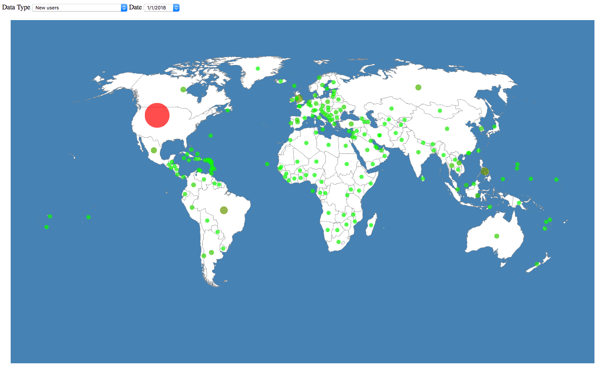

# README #

# Data Visualization on D3

## Installation ##
First step is to install `node.js`, then turn on the terminal and enter:  
`npm install`

## Configuration ##
Copy `rs-config.js.example` to `rs-config.js` and setup it (database authentication) 

## Run ##
* For Windows
`set DEBUG=myapp:* & npm start`
* For Mac
`DEBUG=myapp:* npm start`

## Features

The Data Visualization has 2 main parts:

* Global Map: Displays historical data on a world map. Circles of the country are sized according to the number. Tooltips that appear on mouseover show data for that date and country. 

* Charts: Shows historical data for countries. The world option is also shown for comparion. Tooltips on mouseover show data for that country.

## Data, Methods, and Sources

The data is stored in Redshift. 